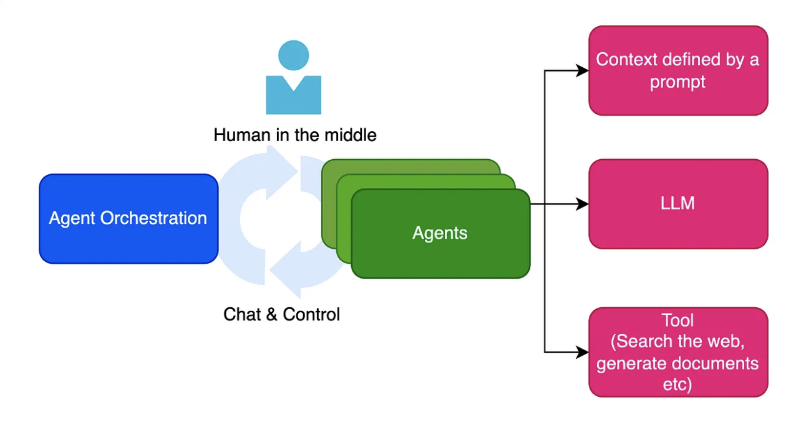

# Chatbot Intelligent Multi-Agents - SupdeVinci

## Contexte

Dans le cadre de l’amélioration de l’accueil et de l’information des utilisateurs sur le site SupdeVinci, nous avons développé un assistant conversationnel intelligent multi-agents. Ce chatbot vise à faciliter l’accès aux informations clés, à orienter les utilisateurs vers les bonnes ressources, et à automatiser certaines interactions comme les demandes d’inscription ou les consultations de documents internes.

## Approche et Architecture

Notre solution repose sur une architecture multi-agents orchestrée par un agent principal :

- **Agent Principal** : détecte l’intention de l’utilisateur et route la requête vers l’agent spécialisé adapté.
- **Agent Web** : répond aux questions liées au contenu public du site SupdeVinci grâce à une base de connaissances vectorisée.
- **Agent Documentaire** : gère les questions relatives aux documents internes (règlement, politiques, etc.) via un système RAG.
- **Agent Action** : prend en charge les actions utilisateur telles que les inscriptions ou formulaires (en développement).

Cette architecture modulaire permet une spécialisation des tâches et facilite l’évolution future du système.

## Outils et Technologies

- **Modèle LLM Google Gemini** : utilisé pour la détection d’intentions et la génération des réponses.
- **LangChain avec Chroma Vector Store** : pour la gestion des bases de connaissances vectorisées (site web et documents internes).
- **Sentence-Transformers (all-MiniLM-L6-v2)** : comme modèle d’embeddings pour la vectorisation des textes.
- **Streamlit** : pour une interface utilisateur simple, réactive et déployable rapidement.
- **Git & GitHub** : pour la gestion de version et le déploiement continu.
- **Dotenv** : pour la gestion sécurisée des clés API.

---

## Structure du dépôt

- `app.py` : application principale Streamlit et orchestrateur des agents.
- `chroma_site/` : base vectorisée des contenus web.
- `chroma_reglement/` : base vectorisée des documents internes.
- `.env` (non versionné) : fichier de configuration des variables d’environnement (ex : clé API).

---

## Installation et Lancement

1. Cloner le dépôt
   ```bash
   git clone https://github.com/ABY-sys/Chatbot-SupDeVinci.git
   cd Chatbot-SupDeVinci
